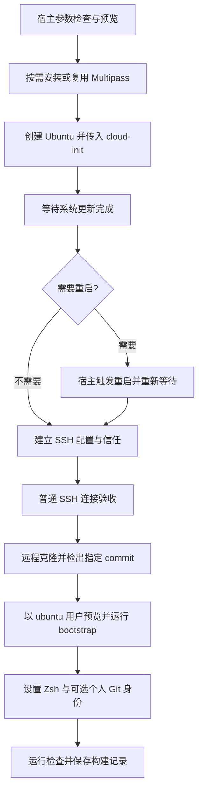

# Multipass Ubuntu 开发机实施方案

制定日期：2026-09-22。原始状态：设计方案，当时尚未实施；后续实施记录见文末。

本方案将用户已经确认的 16 项选择落实为文件职责、接口、执行顺序和验收条件。
目标是从受支持的 Ubuntu 基础镜像出发，通过当前仓库构建可重新创建、可诊断、
可重复配置的个人开发机。

## 1. 已确认的范围与默认值

| 项目           | 首版约定                                                        |
| -------------- | --------------------------------------------------------------- |
| 宿主机         | macOS Apple Silicon；本次真实验收宿主为 macOS 15.8 arm64        |
| 客户机         | Ubuntu arm64，默认 24.04 LTS，允许显式选择 26.04 LTS            |
| 实例           | 默认 `ubuntu-dev`；通过实例名称支持多个同类开发机               |
| 资源           | 4 个 CPU、8 GiB 内存、40 GiB 磁盘；创建时允许覆盖               |
| Multipass 准备 | 脚本自动安装缺失或过旧版本，复用已经满足要求的版本              |
| 首次系统准备   | 更新包索引、安装可用系统更新；需要重启时自动重启后继续          |
| 用户           | 保留 Multipass 默认 `ubuntu` 用户及其管理通道                   |
| 开发环境       | 复用 `scripts/bootstrap.sh --profile server`                    |
| dotfiles 来源  | 从远程仓库检出调用者指定的完整 commit                           |
| dotfiles 位置  | `/home/ubuntu/.dotfiles`                                        |
| 项目目录       | `/home/ubuntu/workspace`，位于客户机自身磁盘                    |
| SSH 用户密钥   | 用户自行创建带密码短语的专用密钥，脚本仅接收公钥路径            |
| SSH 接入       | 宿主机独立配置片段，通过 `Include` 接入，支持 `ssh ubuntu-dev`  |
| 网络           | Multipass 默认网络；宿主机访问客户机，开发服务按需使用 SSH 转发 |
| 下载来源       | 官方软件源；首版按客户机可直接联网设计                          |
| 登录与区域     | Zsh、`Asia/Shanghai`、`C.UTF-8`                                 |
| Git 身份       | 默认手动配置；允许从仓库外的本机配置显式提供姓名、邮箱          |
| 公共操作       | 创建、重新配置、SSH 接入、状态检查                              |
| 生命周期       | 启动、停止、删除继续使用 Multipass 原生命令                     |
| 真实验收       | 在当前 Mac 依次验收 24.04 和 26.04；完成后删除验收实例          |

首版不包含 Docker、Kubernetes、图形桌面、宿主目录挂载、私有仓库凭据分发，
也不要求不同日期得到完全一致的所有软件版本。

“可重复”指相同声明能够重新得到符合仓库要求的环境。固定发行版与仓库提交，
记录镜像哈希和实际版本；保留 bootstrap 对兼容工具的复用策略。APT 更新以及
按需解析的 Go、JDK、Maven 等版本仍可能随时间变化。

## 2. 当前基础与职责划分

当前仓库已经具备以下基础：

- `scripts/bootstrap.sh` 支持 Ubuntu 24.04/26.04，并编排软件、部署、插件与 doctor。
- `--apply` 拒绝 root，安装系统软件时由普通用户调用 sudo。
- `server` profile 准备命令行工具；字体与 Ghostty 应用属于宿主终端客户端。
- bootstrap 本身不设置登录 shell，也不执行整机升级。
- deploy 使用长期依赖仓库目录的符号链接；Codex 角色是具有冲突保护的普通副本。
- 现有测试采用临时 HOME、命令替身和离线资源，不能代替新客户机在线首次安装。

新入口只负责连接这些能力，不复制现有的软件清单或插件安装逻辑。



编排使用 `multipass exec`，日常接入与验收使用用户自己的 SSH 密钥。
这使 SSH 配置问题可以通过 Multipass 管理通道诊断，同时不会漏掉普通 SSH 的验收。

## 3. 目录与文件组织

拟新增以下文件；实施时保持模块数量与实际职责相称。

```text
environments/multipass/
  README.md                 使用说明、先决条件、恢复与清理步骤
  defaults.json             默认镜像、资源、路径、超时等非个人参数
  host-releases.json        Multipass 最低版本、安装包版本、URL、SHA256
  cloud-init.yaml.tmpl      客户机基础初始化模板

scripts/
  multipass.sh              公共入口、参数、阶段编排、锁和信号处理
  multipass/
    host.bash              宿主与 Multipass 检测、安装、就绪检查
    guest.bash             初始化等待、重启、仓库准备、bootstrap 调用
    ssh.bash               SSH 配置、主机公钥与本机入口管理
    runtime.py             JSON 校验、模板渲染、原子文件发布、状态处理
    ssh_proxy.py           每次 SSH 连接时解析实例当前地址并连接

tests/
  multipass.sh              独立离线回归入口
  multipass/
    cases.py               行为测试
    mock.py                Multipass、安装器、SSH、Git 等命令替身
    fixtures/              两个发行版及异常场景的结构化输出
  multipass-live.sh         显式运行的真实虚拟机验收入口

docs/plan/
  multipass-dev-machine.md  本方案
```

`environments` 不加入 `layout_packages`，不通过 Stow 部署。
Multipass 不加入全局 Brewfile，避免普通宿主 bootstrap 强制安装它，或接管已满足要求的安装。

对应更新根 README、`scripts/README.md`、`tests/README.md` 和 AGENTS.md 中的目录、
入口及测试套件数量说明。离线新套件接入 `tests/all.sh`，真实验收保持独立。

本机数据固定使用默认 XDG 路径：

| 路径                                                  | 用途                                    |
| ----------------------------------------------------- | --------------------------------------- |
| `~/.config/dotfiles-multipass/config.json`            | 可选本机默认参数及可选 Git 身份         |
| `~/.local/state/dotfiles-multipass/instances/<name>/` | 实例声明、构建回执、阶段日志、锁        |
| `~/.cache/dotfiles-multipass/`                        | 校验过的安装包缓存                      |
| `~/.local/share/dotfiles-multipass/ssh-proxy.py`      | 按源文件哈希维护的 SSH 地址解析助手副本 |
| `~/.ssh/dotfiles-multipass/config`                    | 由主 SSH 配置 Include 的聚合入口        |
| `~/.ssh/dotfiles-multipass/hosts/<name>.conf`         | 单个实例的 SSH 配置                     |
| `~/.ssh/dotfiles-multipass/known_hosts/<name>`        | 单个实例的已验证主机公钥                |

这些文件均位于仓库之外。生成的 user-data 包含本机公钥和实例标识，也放在实例状态目录，
不提交到 Git。目录权限默认 0700，配置和记录默认 0600。

## 4. 参数与命令接口

以下为拟实现接口，当前尚不可执行。

```bash
# 先预览，再应用；<commit> 必须替换为远程仓库可获取的完整提交 SHA。
bash scripts/multipass.sh create --dry-run \
  --ref <commit> \
  --ssh-public-key "$HOME/.ssh/id_ed25519_multipass.pub"

bash scripts/multipass.sh create --apply \
  --ref <commit> \
  --ssh-public-key "$HOME/.ssh/id_ed25519_multipass.pub"

# 显式选择另一个受支持的发行版和实例名。
bash scripts/multipass.sh create --apply \
  --name ubuntu-dev-2604 --image 26.04 \
  --ref <commit> \
  --ssh-public-key "$HOME/.ssh/id_ed25519_multipass.pub"

# 不指定新 ref 时，继续使用该实例已记录的目标提交。
bash scripts/multipass.sh provision --dry-run --name ubuntu-dev
bash scripts/multipass.sh provision --apply --name ubuntu-dev

# 显式更新仓库版本。
bash scripts/multipass.sh provision --apply --name ubuntu-dev --ref <new-commit>

bash scripts/multipass.sh check --name ubuntu-dev
bash scripts/multipass.sh check --name ubuntu-dev --runtime
bash scripts/multipass.sh ssh --name ubuntu-dev
ssh ubuntu-dev
```

| 参数                    | 约定                                                                                      |
| ----------------------- | ----------------------------------------------------------------------------------------- |
| `--name`                | 默认 `ubuntu-dev`；同时作为 SSH 别名；严格校验实例名                                      |
| `--image`               | 只接受 `24.04` 或 `26.04`，默认 `24.04`                                                   |
| `--cpus`                | 默认 4，正整数                                                                            |
| `--memory` / `--disk`   | 默认 8G / 40G；校验单位、格式及合理下限                                                   |
| `--repo-url`            | 默认 `https://github.com/codeExpert666/dotfiles.git`；首版使用无内嵌凭据的公共 HTTPS 地址 |
| `--ref`                 | 创建时必须指定完整 40 位 Git commit SHA；不隐式跟踪 main 或 latest                        |
| `--ssh-public-key`      | 创建时必需，可来自本机配置；必须是可解析的单把公钥                                        |
| `--config`              | 可选，覆盖默认本机 JSON 配置路径                                                          |
| `--dry-run` / `--apply` | create、provision 默认预览；只有 apply 执行安装与配置                                     |
| `--runtime`             | check 附加现有 doctor 的受控运行检查                                                      |

新建时优先级为命令行参数 > 本机配置 > 仓库默认值。
已有实例的镜像、资源、目录和仓库来源以创建记录为准，本机默认值变化不改写它。
`provision` 允许显式更新 ref 和可选 Git 身份。同一公钥文件移动后可以更新宿主路径，
但指纹必须保持一致；密钥轮换不纳入首版自动配置。镜像或资源变更应另建实例或使用
Multipass 原生命令；检测到与创建声明不一致时明确报告。

create 的幂等规则：同名实例不存在则创建；由本入口创建、创建标识相符且声明一致的实例
允许继续失败阶段或重新验收；其他同名实例报冲突。已经完成的实例不重复运行首次系统更新。
修改目标提交使用 provision，避免 create 隐式承担版本升级。

check 输出状态与故障，不安装、修复或启动实例。ssh 只调用既有 SSH 配置；实例停止时
提示使用 `multipass start <name>`。退出码沿用 0 成功、1 失败、2 参数错误、
信号为 128 加信号值，原始子命令退出码写入错误报告。

## 5. 宿主预检与 Multipass 按需安装

### 5.1 预检

检查 Apple Silicon、macOS 系统要求、普通用户身份、Bash 3.2+、Python 3.9+、
Git、curl、OpenSSH 及默认 HOME/XDG 布局。宿主工具缺失时给出明确依赖诊断；
当前方案自动安装的新增宿主应用是 Multipass，不隐式运行完整宿主 bootstrap。

在写入前校验实例名、资源、公钥、commit、路径、SSH 配置冲突以及可用磁盘空间。
实际解析公钥，拒绝私钥文件、多个密钥和无法解析的内容；模板使用规范化后的类型与
公钥数据，不依赖注释字段。

公钥对应的专用私钥由用户解锁并加载到宿主 ssh-agent。入口只比较目标公钥指纹和 agent
提供的身份，不读取私钥，不处理密码短语。缺少 agent 或目标身份时，在创建虚拟机前
提示用户完成 `ssh-add`。这也是两个版本真实 SSH 验收的前置条件。

预览只读取宿主输入、现有本地记录及可用版本信息，不调用安装器、更新软件源、查询远程
镜像或创建实例；无法离线确认的条件标为 DEFER，apply 开始时重新检查。

### 5.2 版本策略

项目首版最低兼容版本定为 **Multipass 1.16.4**，对应 2026-09-22 核对到的官方稳定版本。
这是本项目的支持与验收基线，并不表示用到的功能最早出现在该版本。
后续通过仓库评审显式提高最低版本，不在每次运行时动态追逐最新版本。
版本事实来源为 [官方发行说明](https://canonical.com/multipass/docs/latest/reference/release-notes/)
和 [官方 release API](https://api.github.com/repos/canonical/multipass/releases/latest)。

优先使用 `multipass version --format json` 获取客户端与 daemon 版本，必要时兼容旧版
文本输出。既有稳定版本双方都达到最低要求且服务可用时直接复用，不调用 Homebrew、
下载服务或安装器。客户端与 daemon 来自同一安装且版本一致作为正常状态检查。
服务不可达、权限不足、PATH 遮蔽或版本异常是诊断错误，不能等同于“没有安装”。
参见 [version 接口](https://canonical.com/multipass/docs/latest/reference/command-line-interface/version/)。

| 检测结果                                         | 处理                                            |
| ------------------------------------------------ | ----------------------------------------------- |
| 合格且服务正常                                   | 复用，不安装、不升级                            |
| 完全未安装                                       | 安装仓库声明的官方 macOS `.pkg`                 |
| 旧版由官方 pkg 安装                              | 使用官方新 pkg 原位升级                         |
| 旧版由 Homebrew 管理                             | 仅定向升级 `multipass` cask，完成后检查实际版本 |
| CLI 不在 PATH，但标准安装路径或 pkg receipt 存在 | 使用实际安装路径诊断，不重复安装                |
| 合格版本服务异常或 CLI/daemon 混装               | 输出具体修复信息，停止；不以重装掩盖问题        |
| 安装器版本低于门槛或校验失败                     | 停止，不降低版本要求                            |

官方 pkg 的首版元数据：

```text
version: 1.16.4
url: https://github.com/canonical/multipass/releases/download/v1.16.4/multipass-1.16.4+mac-Darwin.pkg
sha256: e481704f65bc1650ae8aa5c873eb9137e8b9b403eac60aa603b68d8b4d2c281c
```

该 SHA256 在制定方案时由官方 GitHub release 资产摘要与 Homebrew cask API 交叉核对，
不是下载完成或安装成功的证明。实施时在独立清单保存元数据，下载后验证，再通过
macOS `installer` 执行。官方 macOS 安装与升级均使用 pkg，见
[安装说明](https://canonical.com/multipass/docs/latest/how-to-guides/install-multipass/)。

Homebrew 路径仅在已确认该 cask 受其管理且版本过低时执行
`brew upgrade --cask multipass`；不执行全量 `brew upgrade`，不卸载后重装，
也不使用 `--zap`。安装来源和最后得到的实际版本均写入回执。

安装前在前台取得需要的 sudo 认证，安装后限时等待 daemon 可用，再核对版本、连接和
默认驱动。沿用 QEMU 路径；发现已有其他驱动配置时报告不在首版支持范围，不改全局驱动。
若升级会影响已有运行中的虚拟机，列出它们并要求操作者先自行停止，不强制停止其他实例。

## 6. cloud-init 与更新后的重启

模板只处理基础初始化，拟采用以下骨架：

```yaml
#cloud-config
users:
  - default
ssh_authorized_keys:
  - __RENDERED_SSH_PUBLIC_KEY__
ssh_pwauth: false
disable_root: true
timezone: Asia/Shanghai
locale: C.UTF-8
package_update: true
package_upgrade: true
package_reboot_if_required: false
packages:
  - git
  - ca-certificates
  - python3
```

实际模板还用 `write_files` 写入本次创建的 UUID 标识，供宿主辨认自己创建的实例。
该标识放在 `/var/lib/dotfiles-multipass/instance.json`，由 root 持有。
动态值使用 JSON 字符串编码等可靠方式嵌入 YAML，不执行任意模板表达式，不直接使用
未经转义的 sed 替换用户输入。用户传入的公钥是新增授权，不覆盖 Multipass 管理公钥。

明确设置 `package_reboot_if_required: false` 是为了把自动重启统一交给宿主脚本：
系统更新仍由 cloud-init 执行，用户要求的“需要时自动重启”由下面的编排保证。
这样不需要处理 cloud-init 正在重启时 launch 同时等待的竞态。
配置字段见 [软件更新示例](https://docs.cloud-init.io/en/latest/reference/yaml_examples/package_update_upgrade.html)。

执行顺序：

1. 通过 `multipass find --format json` 验证所选版本当前可用，创建前记录原有实例列表。
2. 保存创建意图与 UUID，再执行明确版本的 launch；不使用默认 LTS 别名，不自动挂载 HOME。
3. 使用足够的 launch 超时，默认初始化阶段上限 3600 秒。
4. 从客户机外部执行 `cloud-init status --wait --format json`，保存状态与日志。
5. 退出码 0 且状态成功才继续；退出码 1 或 2 均保留错误信息并停止。
6. 验证 `/etc/os-release`、`uname -m`、默认用户、sudo 非交互能力和创建标识。
7. 检查 `/var/run/reboot-required`。存在时记录 boot ID，由宿主执行 `multipass restart`。
8. 等待 boot ID 确实变化、管理通道恢复、cloud-init 再次完成，然后重新检查重启标志。
9. 首次配置自动重启最多一次；仍要求重启或超时则报告，不无限循环。

进入 bootstrap 前确认没有未完成的软件包配置。若后台系统更新仍持有包管理器锁，
使用有上限的等待与诊断；不删除锁文件或强行终止 apt/dpkg。

cloud-init 的降级状态不能因为显示 done 就视为成功，退出码 2 的语义参见
[cloud-init 返回码说明](https://docs.cloud-init.io/en/latest/explanation/return_codes.html)。
launch 超时后初始化可能仍在继续，应检查已经创建的实例并记录实际阶段，禁止直接
删除后重建。重试时先确认归属、初始化状态和是否仍有安装任务运行。

## 7. SSH 配置与动态地址

### 7.1 用户认证与主机信任

用户自己的 SSH 公钥由 cloud-init 注入。宿主 SSH 的 `IdentityFile` 指向该公钥文件，
对应私钥通过已解锁的 ssh-agent 使用；`IdentitiesOnly yes` 限定目标身份。
OpenSSH 支持这一公钥与 agent 的组合，参见
[IdentityFile 文档](https://man.openbsd.org/ssh_config#IdentityFile)。

初始化完成后，通过本机 Multipass 管理通道读取客户机的 Ed25519 SSH 主机公钥，
验证其格式并写入该实例专用 known_hosts。设置 `StrictHostKeyChecking yes`，
用带创建 UUID 的 `HostKeyAlias` 区分实例重建，不使用未经核验的 ssh-keyscan 结果建立信任。

先执行一次 `ssh -o BatchMode=yes <alias> ...` 验证用户认证和客户机身份。
只有普通 SSH 真正成功，创建阶段才继续到开发环境准备。运行中的代理未加载目标密钥时，
报出需要解锁密钥，不能将管理通道可用算作普通 SSH 验收通过。

### 7.2 固定别名，按连接查询地址

SSH 配置使用 ProxyCommand 调用小型宿主助手。助手每次读取
`multipass info <name> --format json`，检查运行状态，解析当前默认网络的 IPv4 地址，
再调用宿主 `/usr/bin/nc` 连接 22 端口。stdout 只承载 SSH 字节流，诊断写入 stderr。

该助手不启动、安装或修复虚拟机，也不改 known_hosts。IP 数据经过地址格式校验后
作为独立参数传递，不拼接为待执行的 shell 代码。首版只配置默认网络；不能确定可达地址时
明确失败，不随机选择多网卡地址。实例详情接口见
[Multipass info](https://canonical.com/multipass/docs/latest/reference/command-line-interface/info/)。

动态查询使 `ssh ubuntu-dev` 在虚拟机重启后继续可用，无需靠静态 IP 或改写 SSH 配置。
真实网络地址是否实际变化由测试记录；地址变化分支另由离线替身稳定覆盖。

### 7.3 宿主配置的写入规则

- 对 `~/.ssh/config` 只维护一个可识别的 Include 入口，已有内容逐字保留并先备份。
- 将入口放在适当的顶层位置，避免已有 `Host *` 默认值抢先覆盖实例 User 等设置。
- 聚合配置结束时恢复 `Host *` 上下文，避免 Include 内的 Host 条件泄漏到用户原配置。
- 生成每个实例专属的 Host 块、known_hosts 文件；禁止用 `Host *` 设置实例身份。
- 先生成候选文件并用 `ssh -G` 校验，检查目标别名和已有代表性 Host 的有效配置。
- 已有同名非受管 Host、无法保留语义的配置结构、符号链接或并发修改均报告冲突。
- 发布采用同目录临时文件与原子替换；重复执行不增加 Include 或重复 Host 块。
- 代理助手使用绝对 Python 路径，并按源文件哈希管理其普通副本，避免依赖调用时 cwd。

端口转发由用户按需使用，例如 `ssh -L 8080:localhost:8080 ubuntu-dev`。
首版不配置桥接、固定局域网地址或自动开放服务端口。

## 8. 获取指定提交并准备开发环境

在客户机里以 `ubuntu` 用户执行，HOME 固定为 `/home/ubuntu`，cwd 和环境显式传递。
避免将宿主 HOME、XDG、Git 上下文变量和代理变量整批继承到客户机。

首次准备仓库：

1. 使用公共 HTTPS URL，关闭交互式 Git 凭据提示，不复制宿主 Git 凭据。
2. 在 HOME 下私有暂存目录 clone，再验证目标对象是 commit，检出指定 SHA 的 detached HEAD。
3. 验证 HEAD 与输入完全一致，且必需的 bootstrap、deploy、doctor 文件存在。
4. 仅在目标不存在时发布为 `/home/ubuntu/.dotfiles`，记录 origin 与提交；清理自己的暂存目录。
5. 创建 `/home/ubuntu/workspace`，确认归属为 ubuntu，不创建宿主共享挂载。

完整 clone 后校验目标提交，避免把 `git ls-remote` 没列出某个历史 SHA 误认为提交不存在。
远程取不到目标提交就失败，不回退到分支最新状态，也不传输宿主未提交改动。

随后执行：

```bash
cd /home/ubuntu/.dotfiles
bash scripts/bootstrap.sh --dry-run --profile server
bash scripts/bootstrap.sh --apply --profile server
```

外层以非 root 用户调用 bootstrap；系统安装继续使用已有 sudo 逻辑。
bootstrap 已经调用 deploy 与 doctor，外层不重复列出另一套开发依赖。
只有 bootstrap 成功，才将 ubuntu 的登录 shell 设置为实际安装的 Zsh；再次执行时保持不变。

可选 Git 身份从本机配置读取，仅在显式提供时写入客户机个人 Git 入口，位于共享 include
之后。默认不读取宿主 Git 身份、不自动推断，也不向受管仓库配置写入姓名或邮箱。

## 9. 重跑、显式更新与状态记录

provision 先验证实例创建标识、客户机身份、仓库 URL、目录类型、文件归属和工作区状态。
已有仓库目标 commit 相同且干净时复用；指定不同 commit 时先获取并验证，再切换与配置。
不执行隐式 `git pull`、`reset --hard` 或 `clean`。已跟踪、未跟踪的用户文件产生冲突时均保留。

同一 commit 的重跑不重复整机升级、不清空 workspace、不轮换用户密钥，也不创建第二台机器。
cloud-init 不作为日常重新配置的入口，不使用 `cloud-init clean` 强制重跑首次初始化。

仓库更新仍遵守 deploy 的既有冲突保护。特别是 Codex 角色普通副本发生内容变化时，
不由外层绕过保护；报告受影响文件和现有备份迁移流程。首版不承诺完整事务回滚。
记录“目标提交”“当前检出提交”“最后成功配置提交”，使部分更新失败可以被准确诊断。

每个实例回执至少包含：

| 类别     | 记录内容                                                              |
| -------- | --------------------------------------------------------------------- |
| 归属     | schema 版本、实例名、创建 UUID、guest machine-id、cloud instance-id   |
| 输入     | 请求的发行版、CPU/内存/磁盘、仓库 URL、目标 commit、模板哈希          |
| 实际状态 | 镜像完整哈希、Ubuntu 版本、架构、内核、资源与 cloud-init 状态         |
| 宿主     | macOS、Multipass 客户端/daemon 版本、安装来源、编排代码版本或内容哈希 |
| SSH      | 公钥路径与指纹、主机公钥指纹、受管文件清单                            |
| 开发环境 | 当前/最后成功提交、主要工具版本、bootstrap 日志位置、doctor 结果      |
| 阶段     | 开始与结束时间、最后成功阶段、失败命令与退出码                        |

私钥、密码短语、认证 token 不进入 user-data 或日志。Git 个人身份只在其本机配置与客户机
个人配置中保存；构建回执记录是否显式配置，不重复复制身份内容。

每个实例有独立锁；宿主安装和共享 SSH 入口另有短时锁，避免两个 create 同时安装或
覆盖公共配置。信号处理只终止本次启动的宿主进程并释放自己持有的锁。
不能假设中断本地 `multipass exec` 会停止客户机安装：重试前检查客户机中的 bootstrap
锁和进程，仍在运行时报告，禁止直接删除锁或并发启动另一份安装。

## 10. 故障处理与超时

| 故障                      | 预期行为                                         |
| ------------------------- | ------------------------------------------------ |
| Multipass 已满足要求      | 保持现状；测试必须证明未触发安装器或包管理器     |
| sudo 失败或安装包校验失败 | 停止安装，保留原安装与诊断，不创建客户机         |
| 远程镜像不可用            | 停止并输出所选版本，不回退到其他发行版           |
| 同名实例属于其他来源      | 停止，不接管、不删除                             |
| launch 超时但实例已存在   | 记录真实状态，保留实例，重试检查归属后继续       |
| cloud-init degraded/error | 输出状态与日志，停止后续 bootstrap               |
| 系统重启失败              | 保存 boot ID 与最后状态，停止，不循环重启        |
| SSH 用户认证失败          | 区分 agent、授权公钥、配置与网络问题，提供诊断   |
| SSH 主机公钥不符          | 停止，不关闭校验或自动抹除旧信任                 |
| 仓库提交不存在或下载失败  | 保留目标目录，禁止替换成其他提交                 |
| 仓库或配置有用户修改      | 报冲突，保留内容                                 |
| bootstrap 失败            | 保存其日志和阶段，保留已完成安装，允许修复后重跑 |
| 用户 Ctrl-C               | 清理本次宿主临时资源，说明客户机可能仍有运行任务 |

初始超时建议：单次状态查询 15 秒、下载 600 秒、安装 1800 秒、cloud-init 3600 秒、
重启后就绪 600 秒、外层 bootstrap 7200 秒；实际阶段上限集中声明。
外层超时必须覆盖内层正常耗时，不在超时后悄悄开始第二次相同操作。
仅对可确认的临时网络与就绪探测进行有限重试；配置错误、认证拒绝和校验错误立即失败。

日常 create/provision 失败保留机器便于修复。真实验收实例遵循下一节的独立清理约定，
先收集证据，再定向删除。

## 11. 测试与真实验收

### 11.1 离线回归

新增套件使用临时 HOME、仓库副本和命令替身；普通 `tests/all.sh` 不安装 Multipass、
不联网下载镜像、不创建真实虚拟机。

| 范围       | 必须覆盖的行为                                                                   |
| ---------- | -------------------------------------------------------------------------------- |
| 参数与预览 | 默认值、参数覆盖、两个 image、非法资源/路径/ref、公钥校验、预览无写入            |
| 宿主安装   | 缺失、旧版、合格版、较新版、CLI/daemon 不一致、服务故障、PATH 遮蔽、两个安装来源 |
| 安装保护   | 合格版零安装调用、SHA256 错误、sudo 失败、安装后版本仍低、已有运行实例           |
| 模板       | 正确保留默认用户、引号和特殊字符、单把公钥、创建 UUID、无个人秘密                |
| cloud-init | 完成、退出码 1/2、长初始化、launch 超时后继续、失败日志                          |
| 重启       | 无需重启、需要重启、boot ID 未变、连接恢复、重启标志持续存在                     |
| 归属与重跑 | 未受管同名实例、相同声明续跑、不同声明拒绝、客户机身份改变                       |
| Git        | 指定 SHA、历史 SHA、远程失败、不存在提交、错误 origin、脏工作区、暂存发布失败    |
| 用户上下文 | ubuntu、HOME/cwd、sudo 可用、bootstrap 预览在 apply 前、只在成功后设置 Zsh       |
| SSH        | Include 幂等、配置上下文、已有 Host 冲突、agent 缺少身份、严格主机校验、IP 改变  |
| 状态与并发 | 部分成功准确记录、独立锁、共享文件并发冲突、中断后客户机仍在运行                 |
| 清理       | 只删除本次临时文件和已登记验收实例，不触碰既有实例、密钥和用户 SSH 内容          |

新代码遵循 Bash 3.2、tabs、`shfmt -ci -sr` 与 Python 标准库约定，执行 `bash -n`、
`shellcheck -x`、`shfmt -d -ci -sr` 和适用的 Python 检查。
两版客户机中使用各自实际安装的 cloud-init 执行 `cloud-init schema` 校验生成配置。
宿主不为渲染简单模板引入独立 YAML 框架。

### 11.2 两个 Ubuntu 版本的真实验收

在当前 Mac 顺序执行 24.04、26.04，使用同一个远程 commit、公钥和资源参数。
实例名采用 `dotfiles-test-2404-<run-id>`、`dotfiles-test-2604-<run-id>`，运行前确认不存在。
顺序执行避免同时占用两台 8 GiB 客户机，也便于区分发行版差异。

每个发行版完成：

1. 从新实例完整执行 cloud-init、系统更新、必要重启、SSH 和首次在线 bootstrap。
2. 证明实际系统版本与 arm64 架构正确，并记录镜像哈希和远程 commit。
3. 通过用户专用密钥执行普通 SSH，验证 User、HOME、主机信任和默认登录 Zsh。
4. 检查 `~/.dotfiles`、`~/workspace`、符号链接、普通副本、时区和 locale。
5. 检查 Neovim、Zsh、Git、Node/npm、Go、JDK/javac、Maven 及 server profile 必需工具。
6. 验证 Java 编译运行与 Maven 使用同一 JDK；在真实工具安装后检查 Neovim 对应语言工具可用。
7. 检查 bootstrap 内部 doctor 与单独 `check --runtime`，记录所有 WARN/SKIP 的具体原因。
8. 写入一个测试 workspace 哨兵文件，再重复 provision，确认文件内容不变、Include 不重复、
   已满足要求的 Multipass 和工具不被无条件重装。
9. 使用原生 Multipass stop/start 或 restart 后重新连接，验证 SSH 别名、Zsh、PATH、JAVA_HOME。
10. 汇总日志、回执与结果，定向清理该实例，再执行下一发行版。

不为覆盖条件分支而在真实 Mac 上故意安装旧版 Multipass 或破坏既有安装；这些分支由
命令替身验证。真实验收证明当前宿主路径及两个客户机版本，不能宣称所有升级来源都已原生验证。

### 11.3 清理与最终状态

真实验收成功、失败或可捕获中断时，都尽力先收集 cloud-init、bootstrap、doctor 日志，
随后通过 `multipass delete --purge <本次实例名>` 定向删除登记过且归属匹配的验收实例。
不能使用 `--all` 或全局 purge。命令行为参见
[Multipass delete](https://canonical.com/multipass/docs/latest/reference/command-line-interface/delete/)。

同时删除验收产生的 Host 片段、known_hosts、运行状态和只供验收的代理副本；保留指定的
验收报告目录。若首次验收临时新增了 Include，且其后没有其他受管实例使用该入口，
在确认用户文件未发生并发改动后移除该受管入口；不恢复整份旧文件覆盖用户的新修改。

用户创建的专用密钥不删除，ssh-agent 中的身份不擅自移除。宿主 Multipass 作为已按要求
准备的工具保留，不因删除客户机而卸载。已有实例与已有 SSH 配置应保持原状。

外部强制终止或宿主崩溃可能阻止 trap 运行；验收台账保留足够信息供下次定向收集与清理。
任一验收实例仍未删除时，报告清理失败，不能宣称验收完整结束。

## 12. 分阶段实施与交付

| 阶段              | 主要产物                                                  | 完成条件                             |
| ----------------- | --------------------------------------------------------- | ------------------------------------ |
| A：接口与数据     | defaults、release 清单、CLI、本机配置校验、预览、状态结构 | 离线参数和无副作用测试通过           |
| B：宿主与初始化   | Multipass 按需安装、cloud-init、创建归属、等待与重启      | 安装和初始化的成功/失败分支测试通过  |
| C：接入与开发环境 | SSH 管理、动态地址、固定提交检出、bootstrap、Zsh          | 接入、Git、重跑与冲突测试通过        |
| D：诊断与文档     | check、日志、并发与中断、READMEs、新测试入口              | 静态检查、影响套件和全套离线回归通过 |
| E：真实验收       | 两个新 Ubuntu 实例的完整证据与定向清理                    | 两版通过且验收实例全部清理           |

只有真实验收发现必要问题时，才针对性修改现有 bootstrap/deploy/doctor，并补充对应
故障回归；不顺带改写现有安装策略。相关范围跨套件时运行全套回归。

最终交付包括脚本、模板与清单、使用文档、离线测试、两个版本的真实验收报告及清理证明。
报告中分别列出模拟覆盖和原生验证，保存实际版本、commit、镜像哈希、耗时、WARN/SKIP，
并明确当前已知限制。

实施时需要提供的运行输入只有：用户专用公钥的实际路径、该身份已加载到 ssh-agent、
远程可获取的目标 commit，以及安装时可能需要的宿主 sudo 认证。
这些是执行输入，不影响本方案的目录和行为设计。

## 13. 当前证据范围

本方案已核对当前仓库代码、macOS 15.8 arm64、可用的 Homebrew 路径，以及官方文档与
Multipass 1.16.4 安装包元数据。当前 PATH 未找到 Multipass，不据此断言系统不存在任何
安装残留；实际实施先执行完整探测。

尚未下载或安装 Multipass，尚未创建虚拟机，尚未验证上述拟实现接口。
方案里的命令和测试矩阵是后续实施与验收要求，不是已经通过的执行记录。
