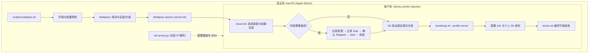

# Multipass Ubuntu 开发机

本扩展在 Apple Silicon Mac 上创建独立的 Ubuntu arm64 虚拟机、自动配置 SSH 接入，并从指定的远程提交运行客户机内的 `bootstrap.sh --profile server`。在已有机器上部署终端环境，直接使用[核心脚本](../scripts/README.md)即可。

客户机用户为 `ubuntu`，HOME 固定为 `/home/ubuntu`，项目目录固定为 `/home/ubuntu/workspace`。本扩展遵循**严格的安全隔离与非破坏性边界**：不挂载宿主目录（两者路径亦不支持自定义），宿主私钥绝不传入虚拟机，不接管同名非受管实例，所有变更均提供预览（`--dry-run`）且支持安全幂等重试。`multipass/` 目录保存 VM 声明与 cloud-init 模板，不作为 GNU Stow 包部署。



## 宿主机要求与首次创建

### 宿主机环境与工具要求

运行入口需满足以下宿主环境约束：

- **硬件与操作系统**：Apple Silicon Mac，运行 macOS 15+，以普通用户身份运行（禁止以 root 运行）。
- **工具链依赖**：准备 Bash 3.2+、Python 3.9+、Git、curl、OpenSSH；脚本还会调用 macOS 原生命令 `pkgutil`、`sudo` 及 `/usr/bin/nc`（用于 SSH ProxyCommand）。
- **网络访问**：网络须可正常访问 Canonical 官方软件源及公共 HTTPS Git 仓库。
- **路径与环境变量**：`$HOME` 与 `~/.ssh` 必须为已存在的真实绝对路径目录（不得为符号链接）；四个 XDG 变量（`XDG_CONFIG_HOME`、`XDG_DATA_HOME`、`XDG_STATE_HOME`、`XDG_CACHE_HOME`）须未设置、为空或直接指向 `$HOME` 下的默认子目录。
- **Multipass 引擎管理**：若宿主机未安装 Multipass 或版本低于[要求版本](host-releases.json)，应用模式（`--apply`）会自动下载校验官方 pkg 并调用 `sudo` 安装或升级；预览模式（`--dry-run`）绝不修改宿主软件环境，也不创建实例。

### 准备 SSH 身份

在宿主机准备专用的 Ed25519 密钥（建议设置密码短语），并解锁添加到 `ssh-agent` 中；若已有专用密钥可直接复用。脚本仅读取普通文件形式的公钥绝对路径，要求 agent 中存在匹配的身份凭证；私钥始终保留在宿主机：

```sh
ssh-keygen -t ed25519 -a 100 -f ~/.ssh/id_ed25519_multipass
ssh-add ~/.ssh/id_ed25519_multipass
```

### 预设个人配置（可选但推荐）

参数解析遵循 **命令行选项 > `~/.config/dotfiles-multipass/config.json` > [默认值](defaults.json)** 的优先级。建议在首次创建前编写配置文件，这样可避免在每次命令中重复输入长公钥路径，并**预先设定客户机内的 Git 身份**：

```json
{
  "name": "ubuntu-dev",
  "ssh_public_key": "/Users/your-name/.ssh/id_ed25519_multipass.pub",
  "git_identity": {
    "name": "Your Name",
    "email": "you@example.com"
  }
}
```

> [!NOTE]
> `ssh_public_key` 须替换为本机的真实绝对路径。`git_identity` 可选，若提供则姓名与邮箱须同时填写且为非空字符串；在客户机 bootstrap 成功后自动写入客户机的个人 Git 配置（`~/.config/git/config`），不触动受管仓库文件。命令行的 `--git-name` 与 `--git-email` 也须成对提供，并作为整体覆盖配置文件中的 `git_identity`，不会混用两个来源的字段。两处都未提供时，新客户机不设置身份，重新配置已有客户机时保留其当前身份；脚本不会读取宿主机的 Git 身份。直接在已有环境运行核心 bootstrap 不会自动设置登录 Shell 与 Git 身份，详见[个人配置](../README.md#个人配置)。

### 选择提交并创建

以下命令均在宿主机仓库根目录执行。将 `<40位SHA>` 替换为远程仓库中可获取的完整小写 Git 提交 SHA；创建完成后开发机将固定在该提交，不会自动跟随 `main` 分支变动。

- **使用配置文件的推荐方式**（若已配置 `config.json`）：

  ```sh
  git ls-remote https://github.com/codeExpert666/dotfiles.git refs/heads/main
  bash scripts/multipass.sh create --dry-run --ref '<40位SHA>'
  bash scripts/multipass.sh create --apply --ref '<40位SHA>'
  ```

- **全命令行参数方式**（无需预先创建 `config.json`）：

  ```sh
  bash scripts/multipass.sh create --dry-run --ref '<40位SHA>' \
    --ssh-public-key "$HOME/.ssh/id_ed25519_multipass.pub" \
    --git-name 'Your Name' --git-email 'you@example.com'
  bash scripts/multipass.sh create --apply --ref '<40位SHA>' \
    --ssh-public-key "$HOME/.ssh/id_ed25519_multipass.pub" \
    --git-name 'Your Name' --git-email 'you@example.com'
  ```

[默认资源规格](defaults.json)为名称 `ubuntu-dev`、Ubuntu 24.04 LTS、4 核 CPU、8 GiB 内存以及 40 GiB 虚拟磁盘。
若需自定义，可在预览和应用命令中同时传入覆盖参数：

- **指定镜像与实例名**：`--image 26.04 --name ubuntu-dev-2604`
- **调整硬件规格**：`--cpus 8 --memory 16G --disk 60G`（内存与磁盘接受正整数 `M` 或 `G`）
- **指定远程仓库**：`--repo-url https://github.com/your-fork/dotfiles.git`

应用模式在执行前会自动检查宿主机磁盘余量（要求剩余空间不少于虚拟机磁盘大小 + 5 GiB），并拒绝接管同名但非受管的既有实例。完整选项可查看 `bash scripts/multipass.sh create --help`。

创建流程会依次完成系统更新与首次启动验收、必要的内核重启、身份与 SSH 配置、仓库检出及核心 server bootstrap。首次更新要求重启时，编排器在核验当前实例身份后，正常停止指定实例、只读确认 `Stopped`、显式启动指定实例，再核验管理连接和新 boot ID；不调用 `multipass restart`。bootstrap 由客户机内的普通用户 `ubuntu` 执行，按需申请 sudo 权限；成功后自动将用户默认登录 Shell 切换为 Zsh。

## 日常使用

以下命令均在宿主机执行，将 `ubuntu-dev` 替换为实际的实例名称；脚本命令在仓库根目录运行。

### 连接与检查

```sh
# 1. 直接通过 OpenSSH 别名连接
ssh ubuntu-dev

# 2. 或使用脚本包装入口（预先核验实例运行状态）
bash scripts/multipass.sh ssh --name ubuntu-dev

# 3. 查看实例状态摘要（输出 JSON 格式）
bash scripts/multipass.sh check --name ubuntu-dev

# 4. 在客户机内运行受控运行诊断
bash scripts/multipass.sh check --name ubuntu-dev --runtime
```

- **SSH 别名机制**：首次 `create --apply` 成功后，脚本会自动在宿主机 `~/.ssh/config` 顶部注入一次受管 `Include` 指令，并生成指向专用代理脚本 `ssh-proxy.py` 的 Host 配置。直接执行 `ssh ubuntu-dev` 会动态解析该实例当前的 IPv4 地址，要求宿主机 `ssh-agent` 中保留有已解锁的专用密钥。
- **端口转发**：支持标准 SSH 语法，例如 `ssh -L 8080:localhost:8080 ubuntu-dev`。
- **状态检查**：`check` 属于只读探测，不会启动已停止的实例，也不会修复状态。它校验声明一致性、客户机内部归属标记（`/var/lib/dotfiles-multipass/instance.json`）及 Git HEAD 状态；附加 `--runtime` 会流式执行[受控诊断](../scripts/README.md#doctor-检查与证据)，并在出现异常时返回非零退出码。
- **客户机内日常操作**：登录客户机后，可在 `~/workspace` 开展开发工作；如需在客户机内自检环境，可直接运行 `~/.dotfiles/scripts/doctor.sh`。

### 重新配置或更新提交

针对已创建完成的实例，使用 `provision` 子命令进行重新配置或切换配置版本。省略 `--ref` 时会自动复用已保存的目标提交；更新提交时将新 40 位 SHA 同时传递给预览和应用命令：

```sh
bash scripts/multipass.sh provision --dry-run --name ubuntu-dev --ref '<新40位SHA>'
bash scripts/multipass.sh provision --apply --name ubuntu-dev --ref '<新40位SHA>'
```

重新配置前，脚本会严格校验客户机仓库的 origin 地址、检查是否存在未提交的跟踪或未跟踪修改，并确认客户机 bootstrap 锁处于空闲状态；检测到冲突时立即停止并保留现场。若首次创建过程意外中断，请遵循[失败处理与恢复边界](#失败处理与恢复边界)中的续跑规则。

需要通过命令行更新客户机 Git 身份时，在 `provision --dry-run` 和 `provision --apply` 中同时传入 `--git-name 'Your Name' --git-email 'you@example.com'`。`provision` 会重新执行完整的仓库检出和 server bootstrap 流程；后续调用若省略这两个参数但配置文件仍有 `git_identity`，会重新应用配置文件中的身份。预览会显示本次身份设置的来源或保留原状，不打印姓名与邮箱。

### 停止与退役

- **日常启停**：在管理通道正常且客户机任务空闲时，直接使用 Multipass 原生命令：

  ```sh
  multipass stop ubuntu-dev
  multipass start ubuntu-dev
  ```

  若实例处于 `Starting`、`Restarting` 等非稳态，切勿作为正常停止状态处理，先按故障排查指引定位。

- **永久销毁与退役（destroy）**：当需要永久移除受管实例时使用 `destroy`。该操作会彻底删除客户机数据，执行前请先核对预览输出并备份重要代码：

  ```sh
  bash scripts/multipass.sh destroy --dry-run --name ubuntu-dev
  bash scripts/multipass.sh destroy --apply --name ubuntu-dev
  ```

`destroy` 的安全保证与清理机制包括：

1. **核实实例归属**：销毁前必须先通过管理命令或安全通道核验客户机内部的创建 UUID、`machine_id` 及 cloud instance-id。若实例处于停止状态，会临时启动以校验身份；已被标记为 `Deleted` 的实例须先执行 `multipass recover <name>`。
2. **定向清理 SSH 配置**：移除该实例对应的 Host 片段与 dedicated `known_hosts`。**当且仅当所有受管实例均被销毁后**，才会自动从宿主机 `~/.ssh/config` 中移除 `Include` 行并清理 `ssh-proxy.py` 助手。
3. **元数据归档退役**：将声明（`declaration.json`）、回执（`receipt.json`）和执行日志移入 `retired/` 目录供日后审计。
4. **非破坏性边界**：若已手动执行过 `multipass purge`，`destroy` 仅收尾清理宿主机状态；它不升级 Multipass、不执行无实例名的全量 purge、绝不删除用户私钥；若检测到受管 SSH 文件被外部篡改，会拒绝操作并保留冲突文件。

## 配置、目录与状态

### 状态目录与文件布局

受管实例的所有配置、运行回执、日志和 SSH 凭据在宿主机与客户机中具有清晰的定位与权限控制：

| 所属位置       | 路径                                                         | 内容与职责                                                                    |
| -------------- | ------------------------------------------------------------ | ----------------------------------------------------------------------------- |
| 宿主机 `$HOME` | `~/.config/dotfiles-multipass/config.json`                   | 个人默认参数与 Git 身份（可选）                                               |
| 宿主机 `$HOME` | `~/.local/state/dotfiles-multipass/instances/<name>/`        | 当前实例的 `declaration.json`、`receipt.json`、`user-data.yaml`、日志及并发锁 |
| 宿主机 `$HOME` | `~/.local/state/dotfiles-multipass/retired/<name>-<uuid>/`   | 实例退役后归档保存的历史声明、回执、操作日志与退役记录                        |
| 宿主机 `$HOME` | `~/.cache/dotfiles-multipass/`                               | 校验过 SHA-256 的官方 Multipass 安装 pkg 缓存                                 |
| 宿主机 `$HOME` | `~/.ssh/config`、`~/.ssh/dotfiles-multipass/`                | 受管 Include、各实例 Host 配置片段与专用 `known_hosts`                        |
| 宿主机 `$HOME` | `~/.local/share/dotfiles-multipass/ssh-proxy.py`             | 经 SHA-256 哈希校验与受管更新的动态地址解析助手                               |
| 客户机 `$HOME` | `~/.dotfiles`、`~/workspace`                                 | 固定提交检出的配置仓库与独立开发项目目录                                      |
| 客户机 `$HOME` | `~/.config/git/config`、`~/.local/state/dotfiles-bootstrap/` | 个人 Git 身份入口及核心 bootstrap 执行日志、原子目录锁                        |

### 安全隔离与配置完整性

- **权限控制**：状态目录默认设为 `0700`，记录文件与声明默认为 `0600`；严禁在日志或回执中记录任何私钥明文或密码短语。
- **SSH 配置文件保护**：宿主 `~/.ssh/config` 顶部仅添加一次受管 `Include` 指令，并带有专有所有权标记注释；在首次修改前会自动创建备份副本（`config.dotfiles-multipass.<uuid>.bak`）。
- **严格的主机密钥校验**：各实例生成的 Host 片段固定登录用户为 `ubuntu`，启用 `StrictHostKeyChecking yes`，并将固定的 Ed25519 主机公钥记录在专用 `known_hosts` 中。若客户机主机公钥发生意外变化，必须人工核实实例身份，脚本绝不自动清空信任记录或放宽检查级别。

## 进度与记录

### 执行阶段与状态标记

命令的执行计划、进度与诊断信息均输出至 stderr；`check` 命令的状态摘要以格式化 JSON 输出至 stdout；`ssh` 命令直接交由交互式会话接管。

控制台日志采用统一的前缀标识：

- `STAGE`：标识主要生命周期阶段；
- `STEP`：标识阶段内部的具体操作步骤；
- `RUN` / `OK` / `SKIP` / `FAIL`：分别表示步骤的开始、成功完成、条件复用（跳过）及执行失败；
- `STEP WAIT`：终端约 30 秒没有可见子任务进度时，打印动作、已耗时与上限；只增长详细日志不会重置计时，已有客户机心跳时不重复输出；
- `CHILD BEGIN` / `CHILD END`：标明客户机 bootstrap 的调用边界；终端展示摘要，完整输出实时写入宿主阶段日志。子程序结束后仍需执行账号设置、最终核验及必要清理，只有全部成功才输出最终 `READY`。

相同管理状态的重复观察约 30 秒显示一次，状态变化立即显示；所有观察仍保存在日志中。
`bootstrap-preview` 的详细计划保存在宿主日志，客户机预览保持只读。显式 dry-run 仍展示完整计划。

创建与配置流程包含 10 个标准的生命周期主阶段：

| 阶段名 (`STAGE`)    | 职责说明                                                            |
| ------------------- | ------------------------------------------------------------------- |
| `host`              | 预检宿主环境，按需安装或升级 Multipass 官方包并核验守护进程         |
| `launch`            | 校验 Ubuntu 镜像可用性，生成 cloud-init 配置并启动虚拟机实例        |
| `cloud-init`        | 监控系统首次启动与初始包升级，核验必要的内核重启                    |
| `guest`             | 传输临时助手脚本，验证客户机所有权标记、系统版本与包管理器锁状态    |
| `ssh`               | 读取客户机 Ed25519 主机密钥，发布宿主 SSH 配置并验证互通登录        |
| `repository`        | 在客户机内克隆或校验目标 Git 仓库，并签出到指定的固定提交 SHA       |
| `bootstrap-preview` | 在客户机内执行 `bootstrap.sh --dry-run --profile server` 离线预检   |
| `bootstrap`         | 在客户机内执行 `bootstrap.sh --apply --profile server` 准备完整环境 |
| `finalize`          | 配置客户机用户登录 Shell（Zsh）并写入可选的个人 Git 身份            |
| `verified`          | 重新核对客户机环境状态，收集已安装工具版本与 doctor 诊断结果        |

### 证据保留与日志记录

终端仅展示当前运行进度。进入应用阶段后，实例目录（`~/.local/state/dotfiles-multipass/instances/<name>/`）会持久化保留完整的执行证据：

| 记录文件 / 字段                                   | 用途与排错价值                                                        |
| ------------------------------------------------- | --------------------------------------------------------------------- |
| `receipt.json` 中的 `stages`、`current_step`      | 记录各阶段的最新执行状态（`running` / `ok` / `failed`）与当前执行步骤               |
| `receipt.json` 中的 `attempts`、`failed_at`       | 记录各次重试尝试的完整历史、失败时间点与具体步骤                      |
| `logs/<尝试ID>/<阶段>.log`                        | 对应尝试各阶段命令的完整 stdout/stderr 输出（旧版平铺日志仍保留原位） |
| `logs/<尝试ID>/operation.log`                    | 本次 create/provision/destroy 的整体结果、阶段外错误和退出清理 |
| `logs/<尝试ID>/destroy.log`                      | destroy 的身份核验、定向删除、SSH 清理与归档步骤 |
| `receipt.json` 中的提交、UUID、镜像与 doctor 计数 | 核对目标声明与实际客户机运行环境是否完全一致                          |
| `receipt.json` 中的 `git_identity_action`         | 本次配置的身份写入进度（`pending` / `applied` / `skipped`）；该字段不含身份值 |

客户机内 bootstrap 的详细安装逻辑与日志排查说明，参见[核心脚本说明](../scripts/README.md#bootstrap-准备完整环境)。

开始和收尾报告本次**宿主日志目录**，不在每个阶段反复输出长路径；客户机 `run.*` 由 bootstrap
单独报告，并在成功收据的 `development.bootstrap_log` 中记录。两边日志均保留完整诊断正文，
只去掉显示控制符；Python 校验异常、命令失败及清理失败会记录具体原因，终端摘要可以较短。
需要查阅客户机日志时须在客户机内打开该路径，不能把 `/home/ubuntu/...` 当作宿主路径。

`destroy --apply` 也会增加 attempt。归档后，日志和 receipt 的路径随状态目录迁入
`retired/<name>-<uuid>/`，后续清理错误继续写入归档中的操作日志；原有历史不会被覆盖。
必要清理失败不会输出 `RETIRED` 或总体 `READY`，主体已有错误时保留主错误并附记清理问题。
未进入应用阶段的预检失败、显式预览及只读检查不新建日志，如实显示没有本次持久化记录。

当前宿主 helper 与新 bootstrap 通过内部摘要/详情事件转发；客户机使用旧提交且不支持事件时，
宿主沿用其原始输出，可能较冗长，但不会舍弃诊断。应使用当前宿主入口执行此流程；反向使用
旧宿主调用新 bootstrap 时，旧宿主无法请求详细事件，完整记录仍保存在客户机 `run.*` 中。
内部环境变量不属于用户配置接口，无需在个人 Shell 配置中设置。

## 失败处理与恢复边界

### 先定位失败和实例状态

执行失败时，脚本始终保留虚拟机实例及已完成的修改，绝不自动回滚或直接销毁。排查时应先查看 `receipt.json` 及对应阶段日志，再在宿主机通过原生命令核对 Multipass 运行状态；宿主守护进程系统日志位于 `/Library/Logs/Multipass/multipassd.log`。若 launch 阶段超时，还须核实客户机内核启动与 cloud-init 的实际执行情况。

| Multipass 状态                        | 诊断与下一步建议                                                                                             |
| ------------------------------------- | ------------------------------------------------------------------------------------------------------------ |
| `Running`                             | 通过日志核对失败步骤；确认客户机身份、cloud-init 和任务处于空闲状态后再续跑                                  |
| `Stopped` / `Suspended`               | 一般先人工核验身份，再执行 `multipass start <name>`；仅有匹配的未完成首次 stop/start 记录时，`create` 才能续跑 `Stopped` 实例；`Suspended` 不自动启动 |
| `Starting` / `Restarting` / `Unknown` | 属于瞬态或通信异常，切勿当作已停止处理；避免调用 `exec` 或 `shell`（可能隐式触发启动）；排查 daemon 日志     |
| `Deleted`                             | 实例已进入回收站，必须先执行 `multipass recover <name>` 恢复实例，再进行检查                                 |
| 实例缺失但存在创建记录                | 保留旧声明与 SSH 信任记录；使用 `destroy` 预览并退役旧状态后再重新创建，或更换全新实例名称；禁止自动同名重建 |

### 管理恢复后选择续跑命令

- **首次创建未完成时**：保留已有声明、初始提交 SHA 和公钥，以**完全相同的参数重新运行 `create`**。脚本会自动识别并复用既有实例，重新验收未完成的阶段并继续推进后续配置；在重试时切勿重新传入仅供全新实例使用的 `--creation-record`。
- **首次启动边界约束**：若 `cloud-init` 阶段（首次启动验收与初始更新）尚未完全成功，执行 `provision` 会被明确拒绝。只有在该阶段成功通过后，后续的重新配置或提交升级才使用 `provision`。
- **首次必要重启与记录**：客户机的全量系统更新仅在首次创建阶段执行一次。需重启时，`reboot_from` 保存原 boot ID；`reboot_operation` 保存 `stop-start` 方式、宿主声明与客户机身份、`planned` → `stop_requested` → `stopped` → `start_requested` → `running` → `verified` 进度及命令返回、实际状态的事件。每个副作用前先持久化意图，只有只读查询确认目标状态后才推进阶段。完成时还要求管理状态 `Running`、`multipass exec` 可用、UUID、machine-id 与 cloud instance-id 匹配、boot ID 已改变、cloud-init 干净完成及 `reboot_required=false`，然后写入 `reboot_to`。stop 不支持 `--timeout`，由命令执行器限制；全流程最多 600 秒，stop/等待 `Stopped`/start 各最多 120 秒，等待 `Running` 与管理重连各最多 180 秒，helper 重传及最后核验各最多 120 秒。每一步还必须服从全流程剩余时间。
- **中断续跑**：以完全相同的声明重新执行 `create --apply`。仅当本地存在与声明及已记录身份匹配的未完成 `reboot_operation` 时，`Stopped` 才可进入自动续跑；`Starting`、`Restarting`、`Unknown` 只做限定时间的只读状态观察，未恢复稳定状态前不调用 guest `exec`、helper 或清理。若 stop/start 命令非零返回，脚本先查询目标状态；已达到目标状态则继续，未达到则保留失败历史与当前阶段。旧进度还在 `planned` / `stop_requested` 而实例已 `Running` 时，先重新核验客户机身份和 boot ID；若已发生重启则直接验收，若仍为原 boot ID 才继续原停止请求。同名替换实例在生命周期命令前被拒绝。仅含 `reboot_from` 的旧收据保持原有核验边界，不能被解释成新的 stop/start 授权。
- **重连重试**：cloud-init 等待、helper 重传及身份探测遇到可识别的 SSH 暂时连接失败时，在各步骤及全流程剩余预算内重试；每次重试前只读确认状态仍为 `Running`。身份不符、权限错误及客户机命令自身失败不会被当作连接故障重试。
- **Helper 脚本安全清理**：若管理通道出现故障，helper 清理操作仅执行只读探测，绝不调用可能隐式启动虚拟机的 exec 命令。未完成的清理路径会暂存为 `pending_helper_cleanup`，待通道恢复并成功清理后移除。清理失败不会掩盖原始报错，原失败 attempt 与日志均完整保留。

### SSH 可达但管理状态异常

当 Multipass 处于 `Starting`、`Restarting` 等异常状态，但客户机 SSH 仍然可连时，不可盲目执行强制操作（Multipass 1.16.4 的普通关机路径会拒绝 `Restarting`），应按以下顺序手动排查恢复：

1. **保存现场并核验身份**：通过受信任的 SSH 连入客户机，核对 `/var/lib/dotfiles-multipass/instance.json` 中的 UUID、`/etc/machine-id` 及 cloud instance-id；确认 `apt`/`dpkg` 和 `bootstrap` 进程均处于空闲状态，确保任务可安全中断。
2. **谨慎尝试正常关闭并启动**：在客户机内执行安全关机（如 `sudo poweroff`），确认宿主机对应 QEMU 进程退出、Multipass 状态刷新为 `Stopped` 后，再执行一次 `multipass start <name>`。这只是已有管理异常的人工恢复尝试；本机 1.16.4 上已有 `Restarting` 实例即使正常关机，随后仍可能停在 `Starting`。
3. **核验证据与守护进程**：重新核对管理状态、连接与实例身份；若状态仍不一致，保留现场。准备宿主 daemon 恢复前，先只读检查全部实例、在途 Multipass 命令和 `/Library/Logs/Multipass/multipassd.log`，确认其他 VM 可中断或已安全停止。`com.canonical.multipassd` 是宿主级服务，重启它会影响所有由该 daemon 管理的实例；由操作人择机执行并逐一验证，不能把这一步当作 `create` 的自动续跑。当前对既有异常实例的 daemon 恢复尚未经实测。

本机可用 `multipass list --format json` 与 `launchctl print system/com.canonical.multipassd` 只读确认服务和实例。若操作人已安排好其他实例的中断窗口，再使用 `sudo launchctl kickstart -k system/com.canonical.multipassd` 重启宿主服务，随后重新查询全部实例状态、管理连接和日志。此命令需要宿主管理员权限；执行前保留当前日志与创建回执。不要在自动创建流程中调用它。

脚本绝不强制关闭电源、不自动重启宿主 daemon，也绝不干扰其他无关实例；仅当用户显式执行 `destroy --apply` 时，才会对经过严格身份比对的受管实例执行彻底销毁。

### Ghostty SSH 输入重复或退格异常

客户机的 `xterm-ghostty` 由[核心 bootstrap](../scripts/README.md#bootstrap-准备完整环境)
准备，GUI 和字体装在客户端。同名重建可能留下 Ghostty 的旧安装缓存，导致 SSH 集成
误以为新客户机已有定义。先通过系统 SSH 检查普通用户的默认搜索路径：

```sh
command ssh ubuntu-dev-2604 'env -u TERMINFO -u TERMINFO_DIRS infocmp xterm-ghostty'
```

若缺失，在客户机使用含此修复的仓库先预览，再执行核心 `bootstrap.sh --apply --profile server`；
或在已启用 `ssh-terminfo` 的 Ghostty 窗口中，移除该目标的缓存后，用 Shell 的 `ssh` 函数重连。
以下命令已按 Ghostty 1.3.1 的 `+ssh-cache --help` 和 Zsh 集成实现核实，目标须匹配
`ssh -G` 输出的 `user@hostname`（示例为受管实例的默认用户和名称）：

```sh
ghostty +ssh-cache --remove=ubuntu@ubuntu-dev-2604
ssh ubuntu-dev-2604
```

重连后再检查 `infocmp xterm-ghostty`。`bash scripts/multipass.sh ssh` 直接执行系统 SSH，
不会经过 Ghostty 的 Shell 包装函数。脚本不自动改动客户端缓存或降级 TERM；
Ghostty 1.3.1 也没有后续版本的 `+ssh` 入口。

### 其他失败的处理

- **并发锁与内容冲突**：遇到宿主机锁（`lock`、`host-install.lock`）、客户机 bootstrap 锁或 Git 仓库变动时，必须先人工确认进程状态。丢失 PID 或无法确定属主的遗留锁不可盲目忽略；受管 SSH 文件发生外部修改时同样保留现场并报错，严禁并行发起第二份安装任务。
- **就绪探测与超时处理**：宿主机安装 Multipass 后的版本与服务探测最长重试 120 秒，若版本不符或驱动配置错误立即终止；launch 后的 SSH 可达性探测最长等待 120 秒，若是 cloud-init 自身执行报错，绝不误当成连接故障盲目重试。

## 维护与验收

### 编排源码与资源清单

- **虚拟机与安装声明**：默认资源在 [defaults.json](defaults.json)，宿主 Multipass 安装版本与 SHA-256 校验在 [host-releases.json](host-releases.json)，客户机初始化模板在 [cloud-init.yaml.tmpl](cloud-init.yaml.tmpl)。
- **编排代码实现**：宿主控制逻辑位于 [scripts/multipass/](../scripts/multipass/)，涵盖运行器、主机探测、SSH 配置及客户机交互。
- **离线回归验证**：[离线测试](../tests/README.md#multipass)通过命令替身和虚拟机模拟验证全量编排状态机与失败保护，不依赖真实 Multipass。

### 真实双版本在线验收

真实双镜像闭环验收需另行显式执行，不会由离线全量套件 `tests/all.sh` 自动触发。准备好专用 SSH 密钥和远程提交后，在宿主机仓库根目录运行：

```sh
# 查看验收脚本支持的选项
bash tests/multipass-live.sh --help

# 启动双镜像完整验收测试
bash tests/multipass-live.sh --ref '<40位SHA>' \
  --ssh-public-key "$HOME/.ssh/id_ed25519_multipass.pub"
```

该验收套件依次针对 Ubuntu 24.04 与 26.04 镜像进行全流程实测：在首次正常 stop 成功后受控中断 `create`，确认实例为 `Stopped`，再用原声明续跑；独立核对管理连接、身份、新 boot ID、cloud-init 与重启标志，然后验收 bootstrap、doctor、重复配置（provision）及日常 stop/start 后的 SSH 联通性。诊断采集在非 `Running` 状态只使用只读管理查询；定向清理必须匹配本轮创建记录、声明与客户机 marker，无法验证时保留实例。
其中终端验收通过系统 SSH 绕过 Ghostty 自动上传，以普通 `ubuntu` 用户的真实 HOME
和默认搜索路径解析 `xterm-ghostty`，再用真实 Zsh 配置做受控 PTY 输入、退格显示及执行结果断言。
报告保留 `terminfo.log`、`ssh-pty.raw` 和 `ssh-pty.json`；这不替代 Ghostty GUI 的人工观察。
若镜像更新后无需重启，套件独立核验首次启动、身份及清除的重启标志，并继续完成其余验收；`reboot-coverage.json` 将中断恢复场景记为 `skipped`，不会冒充已经覆盖。发生重启且受控续跑验收通过时，该字段为 `passed`。汇总报告记录本轮宿主 `runtime_sha256`、实际执行的镜像和各自的 `reboot_coverage`；客户机 bootstrap 的固定提交由 `ref` 单独记录。
若一个镜像已完成、另一个镜像因外部下载超时等原因失败，可用新的 `--report-dir` 并加 `--only-image 24.04` 或 `--only-image 26.04` 单独重试失败镜像；报告的 `images` 字段只列出本次实际执行的镜像。
验收报告默认保存在 `~/.local/state/dotfiles-multipass/reports/<时间戳>/` 中，亦可通过 `--report-dir <绝对路径>` 自定义输出位置；测试结论仅对运行时的指定提交与机器环境有效。

### 自动化归属标记与清理机制

在线验收与高级自动化依托严格的清理与所有权比对机制：

- **三重所有权核验**：清理操作必须同时匹配当前创建记录、宿主机 Multipass 状态以及客户机内部的 instance marker；若存在锁占用或身份不匹配，坚决保留实例。
- **冲突保护**：预先存在的同名实例或遗留状态目录将被拒绝；用户个人 SSH 密钥与宿主机 Multipass 软件始终不予删除。
- **预占所有权记录（`--creation-record`）**：在无人值守的高级自动化流水线中，可在全新实例名上附加 `--creation-record <绝对路径>` 参数。该路径必须指向已存在目录下的尚不存在文件；在 `--apply` 执行且尚未调用 `launch` 之前，预先原子性写入实例名与生成的 UUID，专供异常中断后的归属追溯与安全清理；预览模式（`--dry-run`）不执行写入。
