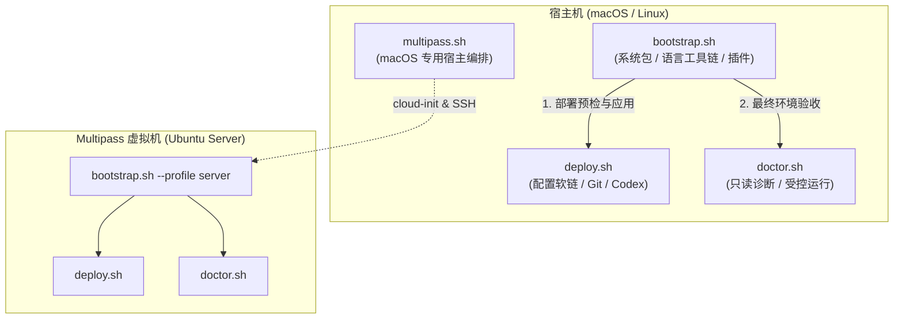

# 脚本使用与维护

首次部署按[根目录快速开始](../README.md#快速开始)操作；本页说明各入口的行为约定和维护位置。
入口可从任意工作目录调用，以下相对路径命令均在仓库根目录执行。完整参数以 `--help` 为准。

## 入口与执行关系

| 入口                         | 职责                                                   | 默认行为                                   |
| ---------------------------- | ------------------------------------------------------ | ------------------------------------------ |
| [deploy.sh](deploy.sh)       | 在当前机器部署配置链接、个人 Git 入口和 Codex 角色副本 | 预览；`--apply` 才写入                     |
| [doctor.sh](doctor.sh)       | 检查当前机器的依赖、部署及应用配置                     | 离线检查；不安装或修复                     |
| [bootstrap.sh](bootstrap.sh) | 准备完整环境，调用 deploy 部署、doctor 验收            | 离线预览；须指定 profile                   |
| [multipass.sh](multipass.sh) | 在 Mac 宿主机管理独立 Ubuntu 开发机                    | 创建、重配和退役默认预览；另提供检查与 SSH |

已有依赖和插件时使用 deploy，需要安装和准备插件时使用 bootstrap。
Multipass 在 Ubuntu 客户机内运行 `bootstrap.sh --profile server`，复用相同的部署和诊断流程。



## 平台与运行约定

### 支持矩阵与运行前提

| 入口      | 支持范围                                                                     | 附加前提                                                                                                            |
| --------- | ---------------------------------------------------------------------------- | ------------------------------------------------------------------------------------------------------------------- |
| deploy    | Linux/macOS，Bash 3.2+                                                       | GNU Stow 支持 `--no-folding`，Git 支持 `--fixed-value`；创建普通文件需要硬链接                                      |
| doctor    | Linux/macOS，Bash 3.2+                                                       | 原生检查依赖相应应用；`--runtime` 需要 Python 3.7+ 和已准备的插件                                                   |
| bootstrap | Ubuntu 24.04/26.04（x86_64、arm64）；macOS 15/26（Apple Silicon），Bash 3.2+ | 普通用户运行，按需 sudo 认证；安装过程中准备 Python 3.9+ 等依赖                                                     |
| multipass | macOS 15+（Apple Silicon），Bash 3.2+                                        | Python 3.9+、Git、curl、OpenSSH、网络和专用 SSH 身份；详见[宿主机要求](../multipass/README.md#宿主机要求与首次创建) |

### 路径与环境变量约束

- **HOME 目录**：`$HOME` 须为已存在的真实绝对路径。
- **XDG 规范**：`XDG_CONFIG_HOME`、`XDG_DATA_HOME`、`XDG_STATE_HOME` 与 `XDG_CACHE_HOME` 须未设置、为空，或直接指向 `$HOME` 下默认的 `.config`、`.local/share`、`.local/state`、`.cache`。
- **路径别名与递归保留**：本机三入口（`deploy`、`doctor`、`bootstrap`）按实际目录身份（`-ef`）识别路径别名；子进程级联调用（如 bootstrap 调起 deploy/doctor）时保留 `$HOME` 的原始路径表达，避免因软链接解析导致路径混淆；Multipass 的宿主 `$HOME`、`~/.ssh` 须为真实目录，XDG 值须直接指向默认路径。
- **ZDOTDIR**：本机入口不得在环境中导出 `ZDOTDIR`，统一由受管 `~/.zshenv` 设置，避免新 Zsh 会话跳过根入口。

### I/O 与退出状态

- **输出流向**：本机三入口的帮助（`-h` / `--help`）写入 stdout；部署与诊断报告、错误和提示写入 stderr。可用 `2>deploy.log` 或 `bash scripts/doctor.sh --verbose 2>doctor.log` 保存完整输出。Multipass 的进度与记录约定见[扩展专文](../multipass/README.md#进度与记录)。
- **信号处理**：捕获 `HUP`、`INT`、`TERM` 时，退出码分别为 `129`、`130`、`143`（即 128 + 信号编号）。
- **退出码约定**：各入口统一遵循退出码语义：
  - `0`：成功 / 诊断无 FAIL / 预览完成；
  - `1`：执行失败 / doctor 健康检查存在 FAIL；
  - `2`：命令行参数错误或检查器初始化失败；
  - `multipass.sh` 同样遵循 `0`（成功）、`1`（执行失败）、`2`（参数错误）。

## deploy 部署配置

```sh
# 默认即为离线预览 (--dry-run)
bash scripts/deploy.sh
bash scripts/deploy.sh --dry-run
# 确认无冲突后执行实际写入
bash scripts/deploy.sh --apply
```

deploy 按 [layout.bash](layout.bash) 选择平台配置，保持公共父目录为真实目录。

| 产物             | 部署与共存规则                                                                                                           |
| ---------------- | ------------------------------------------------------------------------------------------------------------------------ |
| 普通配置         | Stow 建立文件级链接，不折叠整个目录                                                                                      |
| Skills           | 客户端入口链接到包内入口，再链接到 `skills/src/<名称>`；`src` 由 [.stow-local-ignore](../skills/.stow-local-ignore) 排除 |
| 个人 Git 入口    | `~/.config/git/config` 不存在时创建普通文件，包含直接的 `include.path = config.shared`；已有文件须包含该项，不自动改写   |
| Ghostty 平台入口 | macOS 部署 `ghostty-macos`，Linux 上该入口必须缺席                                                                       |
| Codex 角色       | 复制到 `~/.codex/agents/`；相同普通文件复用，内容不同或目标为链接、目录时保留原件并报错                                  |

Skill 的必需客户端由 `layout_skill_clients` 声明，doctor 不从现存链接反推范围。
`astra-sol` 仅声明 `.agents`；这是客户端使用约定，其他扫描该目录的客户端仍可能发现它。
Codex 的 `.codex` 和 `.codex/agents` 保持真实目录，允许个人配置、认证状态及其他代理共存；
修改仓库不会自动更新已部署的角色副本。

### 历史竞争配置与迁移

预检要求相关应用的旧配置入口必须缺席，否则终止部署并提示人工迁移（[layout.bash](layout.bash) 中声明的 `layout_competing`）：

| 模块    | 冲突旧入口（相对 HOME）                                                                        | 受管目标（相对 HOME）            | 迁移处置规则                                                           |
| ------- | ---------------------------------------------------------------------------------------------- | -------------------------------- | ---------------------------------------------------------------------- |
| Git     | `.gitconfig`                                                                                   | `.config/git/config`             | 个人配置移入新文件，须保留并在 `include.path = config.shared` 之后定义 |
| Ghostty | `.config/ghostty/config`<br>macOS: `Library/Application Support/com.mitchellh.ghostty/config*` | `.config/ghostty/config.ghostty` | 备份并移走旧配置；macOS 平台特性在 `platform.ghostty`                  |
| Neovim  | `.config/nvim/init.vim`                                                                        | `.config/nvim/init.lua`          | 迁移为 Lua 配置或移走，确保 Neovim 加载受管配置入口                    |
| Lazygit | `.config/jesseduffield/lazygit/config.yml`<br>macOS: `Library/Application Support/...`         | `.config/lazygit/config.yml`     | 移走旧路径配置                                                         |
| Shuck   | `.config/shuck/.shuck.toml`                                                                    | `.config/shuck/shuck.toml`       | 移走旧隐藏文件名                                                       |

### 预检与冲突保护

- **Stow 预检**：调用目录与 `$HOME` 中不得存在 `.stowrc`，`$HOME` 中不得存在 `.stow-global-ignore`；其他包的自定义忽略规则会提示人工核对。
- **目录保护**：受管配置的公共父目录（如 `.config/`、`.agents/`、`.claude/`、`.codex/` 等）必须保持为真实目录。
- **失败与安全**：检测到目标冲突时安全保留原件并停止；执行中若发生故障，不触发全局回滚，已完成修改予以保留，临时暂存目录由子 Shell 的 trap 自动清理。人工排除报错原因后，重新预览再执行 `--apply`。
- **配置维护**：新增配置包和更新角色的操作见[配置维护](../README.md#新增与维护配置)，个人 Git 覆盖见[个人配置](../README.md#个人配置)。

## doctor 检查与证据

```sh
# 默认执行全部 14 个模块的离线静态检查
bash scripts/doctor.sh
# 定向检查指定模块并输出详细诊断信息
bash scripts/doctor.sh --only deployment --only git --verbose
# 包含受控运行检查（在隔离临时环境中测试应用新会话）
bash scripts/doctor.sh --only zsh --only nvim --runtime
```

### 参数与检查模块

- `--only <MODULE>`：定向选择模块，可多次指定（默认运行全部模块）。
- `--verbose`：在 stderr 中输出有界的原生错误详情与配置覆盖值。
- `--runtime`：启用受控运行会话（仅支持 `zsh`、`nvim`、`lazygit`、`vim`）。
- `-h, --help`：输出帮助并退出。

`doctor.sh` 包含 14 个受检模块，职责划分如下：

| 分类                 | 模块名         | 检查内容与证据                                                           |
| -------------------- | -------------- | ------------------------------------------------------------------------ |
| **环境与基础**       | `environment`  | 校验 HOME 绝对路径、XDG 默认布局变量及 `ZDOTDIR` 未导出                  |
|                      | `deployment`   | 校验 Stow 软链、Skill 客户端两级链接、Codex 角色普通副本及竞争旧入口缺席 |
|                      | `dependencies` | 检查核心工具最低版本；验证 JDK 21+ 与 Maven 3.9.x 的路径与运行时一致性   |
|                      | `state`        | 检查状态和缓存目录存在性与权限（只读探测，不试写，不读取历史内容）       |
| **Shell 与核心工具** | `zsh`          | 检查配置语法、Antidote 插件清单及生成的插件初始化脚本                    |
|                      | `git`          | 检查生效配置层级、共享 include 顺序及核心配置项                          |
|                      | `lazygit`      | 检查配置 YAML 语法、delta 差异高亮与编辑器绑定参数                       |
|                      | `nvim`         | 静态编译 Lua 文件、解析 JSON 声明，检查本地已安装插件与 Mason 工具       |
|                      | `vim`          | 检查后备配置 `.vimrc` 与 XDG state 目录定位                              |
|                      | `shuck`        | 在隔离配置副本中查询 Shuck，检查规则与当前工具链兼容性                   |
| **提示符与历史**     | `starship`     | 调用 Starship 验证所选 prompt 配置有效性                                 |
|                      | `atuin`        | 在隔离环境中验证历史记录搜索配置与敏感凭据过滤规则                       |
| **终端与界面**       | `ghostty`      | 校验 Ghostty 配置有效性；macOS 验证平台入口软链与光标着色器资源          |
|                      | `terminal`     | 校验 terminfo 终端定义、UTF-8 支持、24-bit TrueColor 与客户端字体支持    |

### 判定状态与退出码

独立故障会累积报告，不会在首个故障后停止；最终计数包含环境清理的结果。

| 状态 | 含义                                               |
| ---- | -------------------------------------------------- |
| PASS | 有对应验证证据，范围以报告文字为准                 |
| WARN | 可选组件缺失、能力未准备、偏离锁文件或存在个人覆盖 |
| FAIL | 部署、必要依赖、解析、受控运行或清理发生故障       |
| SKIP | 不适用、未初始化、缺少前提或当前方式无法验证       |

- **退出码**：`0` 表示没有 FAIL（仍可能包含 WARN/SKIP）；`1` 表示健康检查存在 FAIL；`2` 表示参数错误或检查器无法完成初始化。
- **超时保护**：原生应用普通查询限时 8 秒，单个受控运行模块限时 30 秒；超时记为失败并回收子进程。

### 受控运行与边界

`--runtime` 在临时 HOME 中使用配置和插件副本验证新会话，不自动安装或更新。
非默认布局、本机可执行覆盖、未知配置或缺少前提时，相应项目 SKIP。
这是应用级受控运行，不是操作系统沙箱；会话提前退出或进程清理失败均不能算成功。

| 模块    | 运行检查                                              | 主要限制                                                                                            |
| ------- | ----------------------------------------------------- | --------------------------------------------------------------------------------------------------- |
| Zsh     | Antidote 缓存、非交互/登录/PTY 会话、补全、按键与钩子 | 有 `local.zsh` 或 `local.zprofile` 时跳过运行，仍检查默认配置语法                                   |
| Neovim  | 锁定插件、已有 LSP、格式化、Zsh 诊断和 parser         | 关闭安装与更新；额外启动代码或配置目录链接会跳过运行，Stow 文件级链接可用；不获取 Taplo 远程 schema |
| Lazygit | 临时仓库中的真实 TUI、delta 渲染和编辑器参数          | 自定义 YAML、多配置层不作为仓库基线；编辑器本身由 Neovim 检查                                       |
| Vim     | 配置发现、行号和状态目录                              | 使用受管配置副本                                                                                    |

新会话通过不代表已经运行的 Shell 或编辑器已加载新配置。Atuin 任意环境覆盖、Shuck 项目
配置、GUI 渲染、剪贴板及 SSH 客户端字体不由这些检查完整覆盖，须结合实际使用验收。

## bootstrap 准备完整环境

```sh
bash scripts/bootstrap.sh --dry-run --profile server
bash scripts/bootstrap.sh --apply --profile server
```

`server` 准备命令行环境与 terminfo 工具；`desktop` 额外准备 Ghostty、两套字体和 Linux
剪贴板工具。profile 控制软件与字体，配置包按平台选择。远程字体装在终端客户端，
Ghostty SSH 集成向远端提供终端定义。

### 预检与执行流程

除共同路径约定外，`NVIM_APPNAME` 须未设置或为 `nvim`。预检拒绝 `GIT_DIR`、
`GIT_WORK_TREE` 等改变 Git 仓库上下文的变量，即使值为空；完整清单见
[common.bash](bootstrap/common.bash)。Git 用户配置、鉴权和配置选择变量仍保留。

预览离线读取声明并探测真实 PATH 中的命令，不调用包管理器或下载资源；探针隔离
HOME/XDG、日志、临时文件和工作目录。Git/Stow 未达标时，部署预检延后到依赖安装完成。

| 阶段       | `--apply` 执行内容                                                                                                                                          |
| ---------- | ----------------------------------------------------------------------------------------------------------------------------------------------------------- |
| 软件与能力 | 准备平台软件及所需 Go/JDK/Maven，探测 npm、C、Java/Maven 能力                                                                                               |
| 部署       | 运行 deploy 预检，再部署配置                                                                                                                                |
| 插件与资源 | 准备 Zsh、Neovim 插件和工具；desktop 另准备桌面软件及字体                                                                                                   |
| 验收       | 复查工具链能力，运行适用的 doctor 诊断（含受控运行检查），清理后汇总。server 检查 12 个基础模块（自动排除 ghostty 与 terminal），desktop 执行全部 14 个模块 |

macOS 首次安装可能需要完成 Command Line Tools 安装窗口后重跑。apt 操作和 Homebrew
初始安装器启动前先检查免密 sudo 权限，必要时在前台认证；不运行后台 sudo 保活。
长任务后认证可能过期，拒绝认证会停止当前阶段并保留已完成内容。

### 软件来源与复用

| 范围      | 复用条件与安装来源                                                                                                                                                                                   |
| --------- | ---------------------------------------------------------------------------------------------------------------------------------------------------------------------------------------------------- |
| macOS 包  | Brewfile 补齐 Homebrew 管理的包，即使 PATH 中已有其他来源的命令；Bundle 使用 `--no-upgrade`，仅定向升级未达标工具                                                                                    |
| Ubuntu 包 | 复用兼容命令，缺失时先用 apt，再按声明使用固定资源或后备资源；24.04 的 Ghostty 来自固定社区 deb，26.04 来自发行版包                                                                                  |
| Go        | 用 `GOTOOLCHAIN=local go version` 检查最低要求；否则从 [Go 官方列表](https://go.dev/dl/?mode=json)选最新稳定版，校验 SHA256，发布 `~/.local/bin/go`、`gofmt`                                         |
| JDK       | 优先 `JAVA_HOME`，否则查询 PATH 中的 `java.home`；完整且版本一致的 JDK 21+ 可复用，否则从 [Adoptium](https://api.adoptium.net/v3/assets/latest/25/hotspot)安装经 SHA256 校验的最新 Temurin JDK 25 GA |
| Maven     | 复用使用所选 JDK 的稳定 3.9.x；否则从 [Maven Central](https://repo.maven.apache.org/maven2/org/apache/maven/apache-maven/maven-metadata.xml)选最新稳定 3.9.x，校验 SHA512，发布 `~/.local/bin/mvn`   |

最低要求见 [requirements.tsv](bootstrap/requirements.tsv)，其他固定归档见
[releases.json](bootstrap/releases.json)。首次安装版本和必要依赖由各来源决定；
Go/JDK/Maven 达标后离线复用，不追逐新版本，也不列入 Brewfile 或 apt 清单。
归档先校验、暂存，再发布；损坏资源不会替换有效安装，非受管入口冲突会保留并报错。

受管 JDK 发布到 `~/.local/share/dotfiles-bootstrap/jdk/current`，Zsh 自动设置其
`JAVA_HOME` 和 PATH，登录时在 `brew shellenv` 后恢复优先级。需要其他 JDK 时，在
`local.zprofile` 同时调整两者。Maven 的隔离探针不读写个人 `~/.m2`。
Go 模块可按默认 `GOTOOLCHAIN=auto` 选择更新工具链；若个人配置禁用自动切换，须自行满足
Mason 模块的要求，bootstrap 不改写该设置。单独运行 Brewfile 只准备软件，不完成部署和验收。

### 插件与桌面资源

| 资源   | 准备规则                                                                                                                                  |
| ------ | ----------------------------------------------------------------------------------------------------------------------------------------- |
| Zsh    | Antidote 下载缺失插件并更新必要缓存，不主动更新已有插件；清单未锁定提交，新机器使用下载时的上游版本                                       |
| Neovim | 用配置副本与 `lazy-lock.json` 恢复插件，不写回锁文件；Mason 按配置和 registry 解析工具，Treesitter 跟随锁定插件修订，补全资源也须准备成功 |
| 字体   | 按内部族名选择并保留许可，Sarasa Term SC 解包需要 7zz；macOS 用 Ghostty `+list-fonts --family=...` 精确验收                               |

Neovim 准备会立即输出各动作的 `RUN`，完成时输出带耗时的 `READY`，失败时输出带原因的
`FAIL`。整个准备期间通过通知报告的 `ERROR` 也会使总体准备失败；普通警告不改变退出码。
插件准备、Mason registry 与逐项工具安装、Treesitter `install → update → verify`、
补全资源各有独立边界。动作运行期间约每 30 秒输出 `WAIT`；`elapsed` 只计当前动作，
`timeout` 是该动作适用的本地上限。Mason registry 和补全资源各为 300 秒，单个 Mason
工具与 Treesitter 的 install、update 各为 600 秒。标为 `none (caller controls the total
command)` 的动作没有单独上限；由 `bootstrap.sh` 的 Neovim 命令总上限 2400 秒保护。
通过 Multipass 调用时，宿主的 `STEP WAIT [bootstrap/child]` 另计整个客户机 bootstrap
命令的耗时和 7200 秒上限，不代表当前解析器的耗时。

Treesitter 的 `PARSER` 行来自锁定插件实际创建的解析器任务，带 UTC 时间、当前动作累计耗时、
解析器名及下载、编译、安装等插件事件；`WAIT` 中的 `active` 只列出已发出事件且尚未报告
安装完成的解析器。若插件尚未发出解析器事件，会明确写出仍在等待插件任务。更新已有解析器时，
旧 `parser.so` 的存在不代表修订对齐完成；只有插件 update 任务结束后才会输出该阶段的
`READY`。插件报告的下载器或编译器原始错误会出现在 `PARSER FAIL` 和阶段 `FAIL` 中。
这些行同样进入下方的 bootstrap `run.*` 日志；通过 Multipass 运行时，客户机输出也会原样
进入宿主对应尝试的 `bootstrap.log`。若耗时仍不明，可按阶段与解析器事件的时间戳检查两处日志，
再对照客户机的 `~/.local/state/nvim/mason.log`。

字体重跑会复用已可查询的族名。macOS 发布或复用受管字体后最多等待 30 秒供系统识别；
查询失败或超时会保留文件供重试，不能仅凭 Ghostty 默认等宽字体列表判断字体缺失。

### 日志、失败与重试

| 内容             | 默认路径                                                                                        |
| ---------------- | ----------------------------------------------------------------------------------------------- |
| 日志与并发锁     | `~/.local/state/dotfiles-bootstrap/` 下的 `run.*`、`lock/pid`                                   |
| 校验过的下载缓存 | `~/.cache/dotfiles-bootstrap/`                                                                  |
| 工具与入口       | `~/.local/share/dotfiles-bootstrap/<工具>/<版本>-<平台>/`、`~/.local/bin/`                      |
| 插件与工具       | `~/.local/share/antidote/`、`~/.cache/antidote/`、`~/.local/share/nvim/`                        |
| 字体             | Linux：`~/.local/share/fonts/dotfiles-bootstrap/`；macOS：`~/Library/Fonts/dotfiles-bootstrap/` |

- **长任务与中断**：长任务输出同时进入终端与日志。命令、日志转发或必要清理失败都会阻止总体成功；主体错误或中断退出码优先保留，清理错误另行报告。捕获中断信号（HUP/INT/TERM）时自动回收本次任务的进程组并释放排他锁。
- **并发锁与异常恢复**：`~/.local/state/dotfiles-bootstrap/lock` 为原子目录锁。若因进程被外部强行终止（如 `kill -9`）导致遗留孤儿锁，重跑会拒绝并报错。此时先确认 `lock/pid` 记录的 PID 进程已不在运行，再手动执行 `rm -rf ~/.local/state/dotfiles-bootstrap/lock` 即可解除锁定。
- **失败与幂等重试**：失败不整体回滚。排除报错原因（如网络故障、命令入口冲突或脏插件分支）后重跑同一命令，已达标步骤会自动跳过并复用；成功时仍应核对 doctor 的 WARN/SKIP。
- **个人收尾**：Git 身份、登录 Shell 和 Atuin 历史属于[个人收尾操作](../README.md#个人配置)。

## multipass 创建和管理 Ubuntu 开发机

宿主入口负责实例生命周期、SSH 与状态记录；客户机从固定远程提交运行核心 server
bootstrap。项目目录为客户机的 `~/workspace`，不挂载宿主目录，私钥留在宿主机。

```sh
# 检查开发机状态与 SSH 联通性
bash scripts/multipass.sh check
# 预览创建流程（默认不写盘）
bash scripts/multipass.sh create --dry-run
# 实际创建开发机并在客户机内运行 server bootstrap
bash scripts/multipass.sh create --apply
# 连接到运行中的开发机
bash scripts/multipass.sh ssh
# 预览退役并销毁虚拟机与宿主状态
bash scripts/multipass.sh destroy --dry-run --name <实例名>
```

### 编排流程与生命周期

Multipass 编排在执行 `--apply` 时包含 10 个标准的生命周期阶段：

1. `host`：检查宿主机架构、依赖工具与 Multipass 服务状态；
2. `launch`：创建并启动指定镜像的 Ubuntu 实例；
3. `cloud-init`：核验首次启动与初始更新；需重启时记录 stop/start 意图与原 boot ID，正常停止、确认 `Stopped`、显式启动，再验收管理连接、身份、cloud-init 和新 boot ID；
4. `guest`：验证客户机身份、系统架构与基础包环境；
5. `ssh`：发布专用 SSH 身份并建立无密码 sudo 信任；
6. `repository`：在客户机 `~/workspace` 克隆受管仓库并检出固定提交；
7. `bootstrap-preview`：在客户机内离线预览 server profile bootstrap；
8. `bootstrap`：在客户机内执行真实安装、配置部署与插件准备；
9. `finalize`：应用客户机环境标记与账号收尾；
10. `verified`：执行最终健康诊断并回传验证证据。

`create`、`provision` 和 `destroy` 默认预览，前两者应用时可能安装或升级宿主 Multipass；
`check` 查询状态，`ssh` 登录运行中的实例。宿主和客户机有独立的状态及输出约定，具体见：
[首次创建](../multipass/README.md#宿主机要求与首次创建)、
[日常使用](../multipass/README.md#日常使用)、
[配置与目录](../multipass/README.md#配置目录与状态)、
[失败恢复](../multipass/README.md#失败处理与恢复边界)。

首次 stop/start 的未完成阶段保存在 `receipt.json` 的 `reboot_operation` 中。重新 `create --apply` 只在声明和客户机身份匹配时续跑：`Stopped` 可以接着启动；旧停止请求遇到已 `Running` 的实例时，先核验当前身份和 boot ID，已完成重启则只做验收。helper 和身份探测的暂时连接故障在剩余预算内重试，管理状态异常时停止重试。旧式仅含 `reboot_from` 的收据只验收已有重启，不获得新的自动启动权限。`Starting`、`Restarting` 和 `Unknown` 在管理状态稳定前只读查询，不运行 guest 命令。异常实例的宿主 daemon 恢复须按[人工恢复步骤](../multipass/README.md#ssh-可达但管理状态异常)单独处理。

## 维护与验证

### 修改入口与声明

公开 `.sh` 入口负责运行状态、阶段和 trap；被 source 的 Bash 文件只声明函数或数据。
Python 标准库负责文件操作、PTY 和 Multipass 编排，Lua/Zsh 负责对应运行时。
按职责维护下列位置，避免将安装要求、部署目标和诊断等级混为一份清单：

| 位置                                                                                                                                    | 维护内容                                                              |
| --------------------------------------------------------------------------------------------------------------------------------------- | --------------------------------------------------------------------- |
| [layout.bash](layout.bash)                                                                                                              | Stow 包、默认目录、旧入口、Skill 客户端及角色副本                     |
| [requirements.tsv](bootstrap/requirements.tsv)、[releases.json](bootstrap/releases.json)                                                | 最低要求与固定归档；最低版本 `0` 表示先检查可执行文件                 |
| [macOS](bootstrap/macos/)、[Ubuntu](bootstrap/ubuntu/)                                                                                  | 平台安装器、包清单及 desktop 增量                                     |
| [resources.py](bootstrap/resources.py)                                                                                                  | 按需解析 Go/JDK/Maven、资源校验和发布                                 |
| [common.bash](bootstrap/common.bash)、[without_tty.py](bootstrap/without_tty.py)                                                        | 准备流程、探针、进程与终端隔离                                        |
| [zsh.zsh](bootstrap/zsh.zsh)、[nvim.lua](bootstrap/nvim.lua)                                                                            | 准备 Zsh 插件 bundle 缓存与 Neovim 锁文件插件、Mason 工具、Treesitter |
| [doctor/](doctor/)                                                                                                                      | 配置检查、受控会话、超时与后代进程清理                                |
| [multipass/](multipass/)                                                                                                                | 宿主编排、客户机助手、SSH 发布与地址解析                              |
| [VM 声明](../multipass/defaults.json)、[宿主安装声明](../multipass/host-releases.json)、[cloud-init](../multipass/cloud-init.yaml.tmpl) | 虚拟机资源和初始化，不参与 Stow 部署                                  |

平台清单遵循以下约定：Shuck 只信任指定 formula；Tree-sitter 命令使用 `tree-sitter-cli` 包。
Ubuntu 的 `apt_commands` 按 `包名|命令列表` 映射，空列表检查 dpkg 状态；`release_commands`
可提供多个命令，`apt_fallbacks` 仅在 apt 结果仍不兼容时使用，发行版后缀数组加载时须重置。
Homebrew 初始安装器的固定提交与校验值留在 macOS 安装器中，因为此时尚不能依赖 Python。

### 静态检查与验收

生产脚本的静态检查如下；回归套件选择、测试代码静态检查和额外验收见
[测试说明](../tests/README.md)。工具缺失应记录为未验证。

```sh
files=(scripts/*.sh scripts/*.bash scripts/bootstrap/*.bash scripts/bootstrap/*/*.bash)
for file in "${files[@]}"; do bash -n "$file" || exit; done
shellcheck -x "${files[@]}"
shfmt -d -ci -sr "${files[@]}"
for file in scripts/bootstrap/zsh.zsh scripts/doctor/zsh.zsh; do zsh -n "$file" || exit; done
stylua --check --indent-type Spaces --indent-width 2 scripts/*/*.lua
python3 -B - <<'PY'
import ast
from pathlib import Path
for path in Path('scripts').rglob('*.py'):
    ast.parse(path.read_text(), filename=str(path))
PY
```

更新资源要核对来源、校验值、最低要求和平台清单；更新插件锁要验收真实插件 API、
Zsh/Neovim 会话及锁文件不被准备流程改写。离线替身只证明编排和失败处理，首次安装、
平台包管理器、桌面效果及真实 VM 须在相应环境验收。
